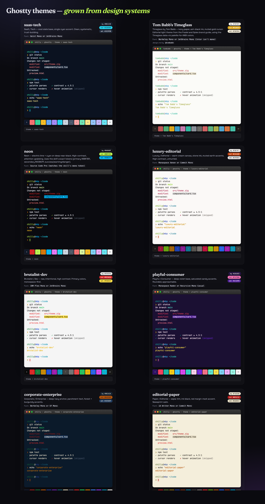
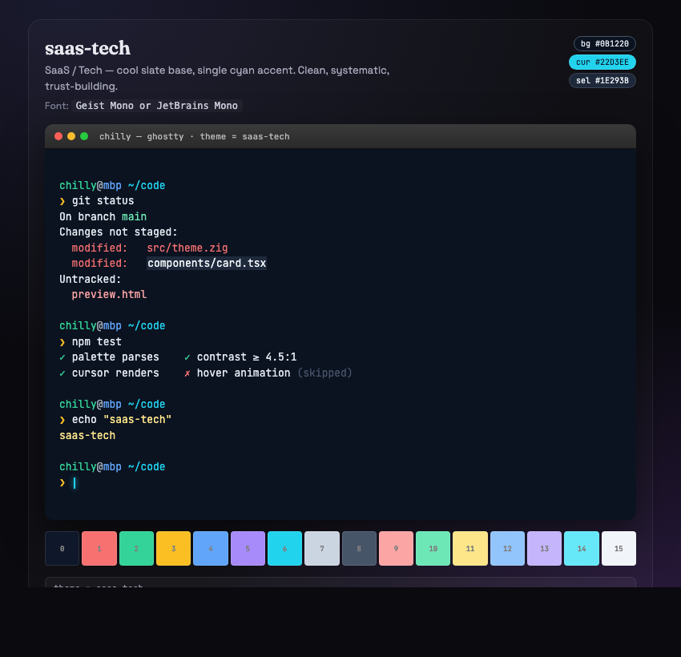
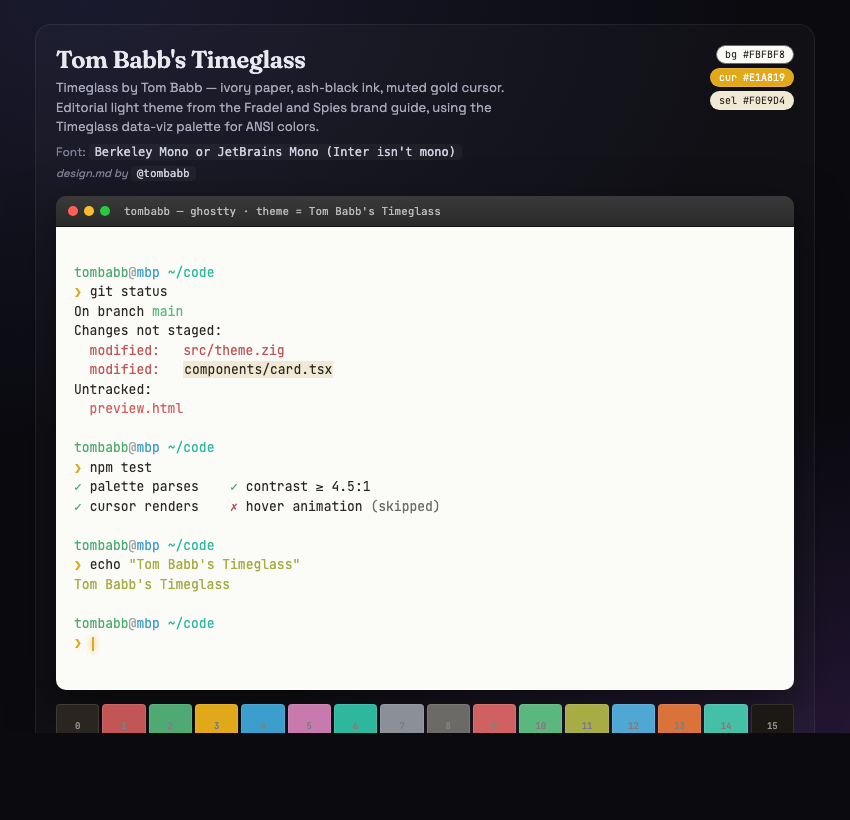
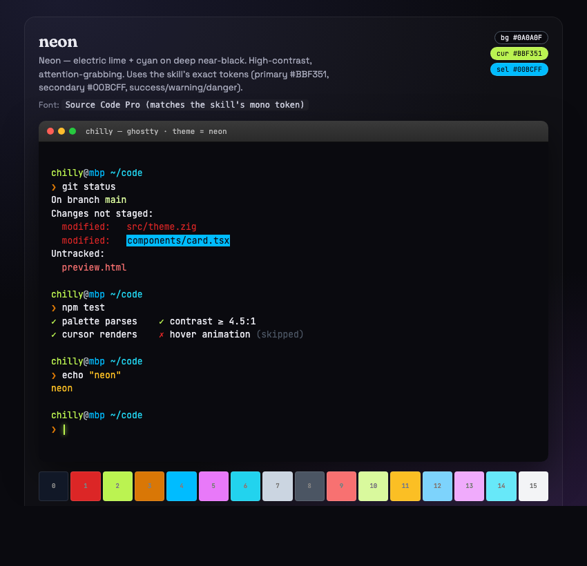
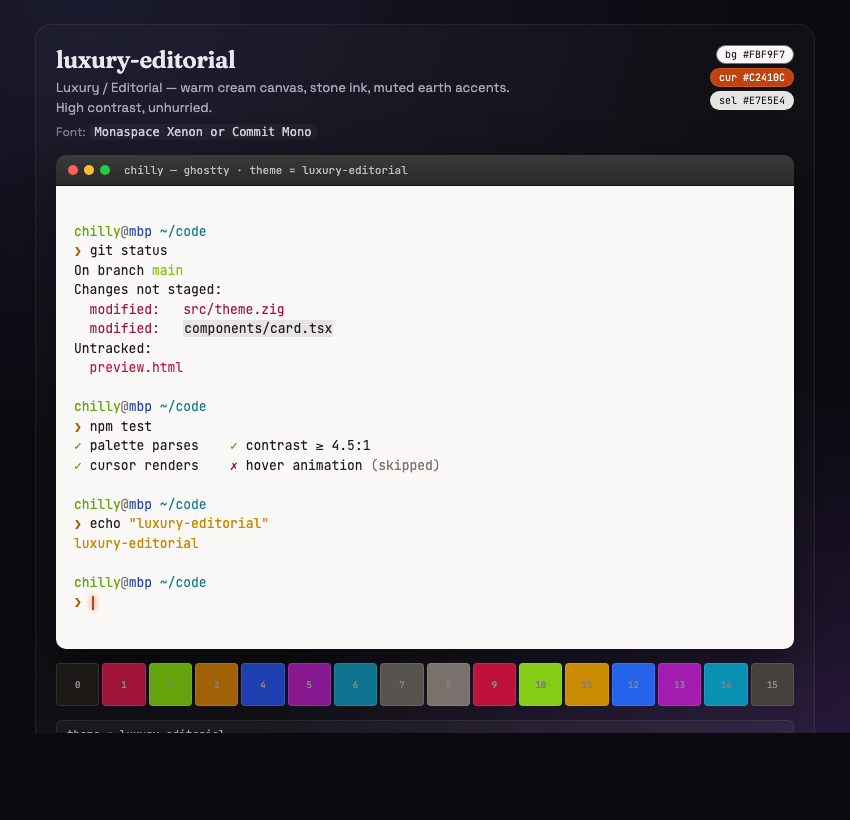
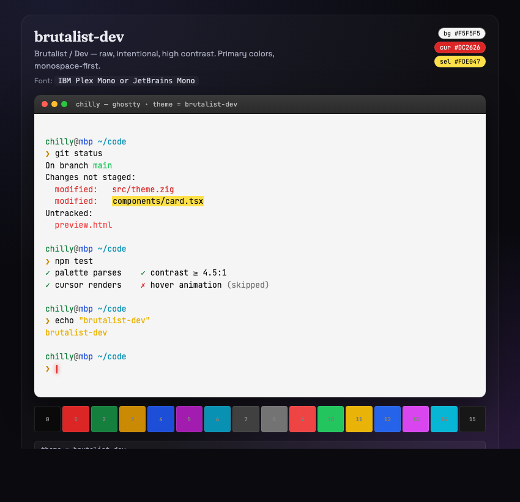
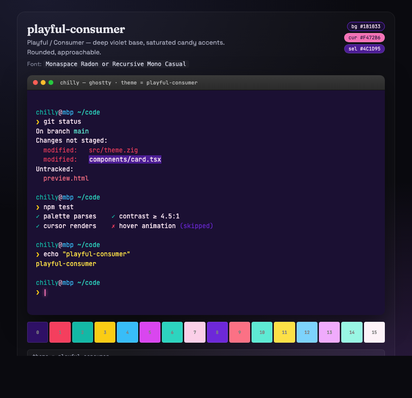
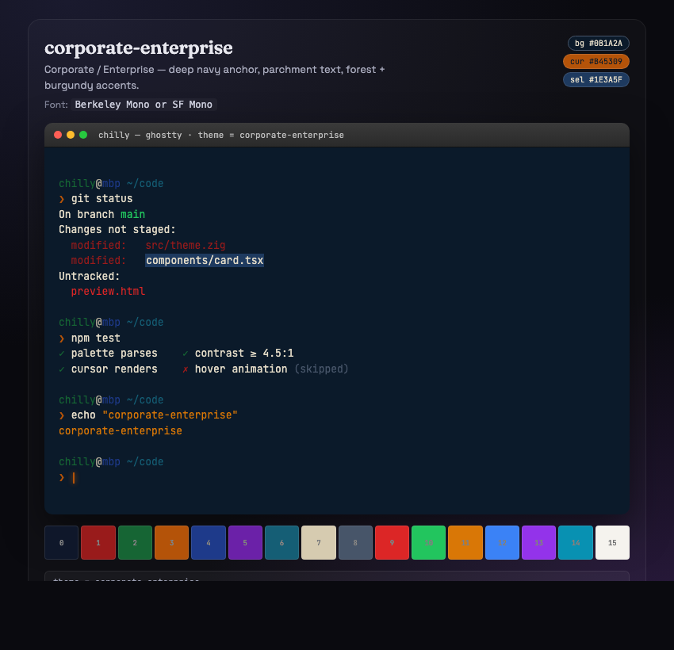
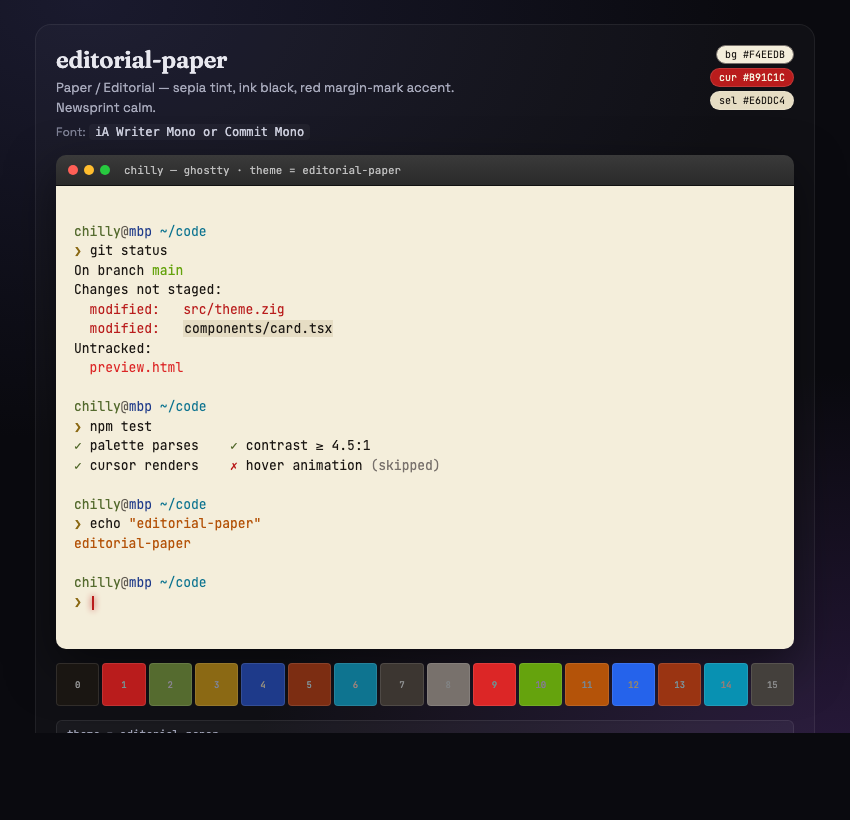

# Ghostty Design Themes

Eight [Ghostty](https://ghostty.org) terminal themes grown from real design systems — six from a "Frontend Architect" archetype prompt, one from the Neon design system, and one from Tom Babb's Timeglass brand guide.

Every theme:

- Respects ANSI semantics (red = errors, green = success, cyan = info) so `git`, `ls --color`, `htop`, and TUIs look right.
- Avoids pure `#FFFFFF` / `#000000` and the generic-AI slop blue.
- Hits ≥ 4.5:1 contrast on body text (WCAG AA).
- Commits to a palette direction — warm, cool, editorial, electric — no mushy in-between.
- Passes `ghostty +validate-config` with no warnings.

**Live preview:** [rdsciv.github.io/ghostty-design-themes](https://rdsciv.github.io/ghostty-design-themes/)



---

## Install

```bash
# Clone into Ghostty's theme directory
git clone https://github.com/rdsciv/ghostty-design-themes.git /tmp/ghostty-design-themes
mkdir -p ~/.config/ghostty/themes
cp /tmp/ghostty-design-themes/themes/* ~/.config/ghostty/themes/
```

Or drop individual files into `~/.config/ghostty/themes/` (no extension, one file per theme — matches Ghostty's shipped convention).

Activate in `~/.config/ghostty/config`:

```ini
theme = saas-tech
```

Or use adaptive light/dark (Ghostty follows macOS system appearance):

```ini
theme = dark:saas-tech,light:Tom Babb's Timeglass
```

> **Heads up:** per the [Ghostty theme docs](https://ghostty.org/docs/features/theme), user-config values override themes. Remove any `background = …`, `foreground = …`, `cursor-color = …`, or `selection-*` lines from your main config, otherwise they'll clobber whichever theme is active.

---

## The themes

### `saas-tech`
*SaaS / Tech — cool slate base, single cyan accent. Linear / Vercel energy.*



Dark `#0B1220` base, cool-slate foreground, `#22D3EE` cyan as the single committed accent. Everything else (red, green, yellow) is desaturated toward slate so cyan never fights for attention. Pairs well with **Geist Mono** or **JetBrains Mono**.

---

### `Tom Babb's Timeglass`
*Editorial light theme from the Fradel and Spies Timeglass brand guide. `design.md` by [@tombabb](https://github.com/tombabb).*



Ivory paper `#FBFBF8` over ash-black ink `#2A2521`, with muted gold `#E1A819` as the hero cursor. The Timeglass 10-color data-viz palette becomes the ANSI palette: crimson = red, teal = cyan, gold = yellow. Steel `#8A8F98` is the dim-text color. Best with **Berkeley Mono** or **JetBrains Mono** (the brand's Inter and Sort Mill Goudy aren't monospace).

---

### `neon`
*Electric lime + cyan on deep near-black. High-contrast, attention-grabbing.*



Uses the Neon design system's exact tokens: primary `#BBF351` lime as cursor, secondary `#00BCFF` cyan as selection background (highlights feel like backlit tape), `#16A34A` / `#D97706` / `#DC2626` for success / warning / danger. Goes well with **Source Code Pro** (the skill's mono token).

---

### `luxury-editorial`
*Warm cream canvas, stone ink, muted earth accents. High contrast, unhurried.*



Warm-cream `#FBF9F7` base with stone-900 `#1C1917` ink, terracotta cursor. ANSI palette uses muted, editorial-appropriate tones — burgundy rose for red, olive-lime for green, mustard for yellow, ink blue for blue. Pairs with **Monaspace Xenon** or **Commit Mono**.

---

### `brutalist-dev`
*Raw, intentional, high contrast. Primary colors, monospace-first.*



Off-white `#F5F5F5` paper, near-black `#0A0A0A` ink, primary-color palette with yellow-highlighter selection `#FDE047` (feels like literally marking text in a book). **IBM Plex Mono** or **JetBrains Mono**.

---

### `playful-consumer`
*Deep violet base, saturated candy accents. Rounded, approachable.*



Violet-night `#1B1033` background with pink-cream foreground `#FCE7F3`, `#F472B6` pink cursor. Palette leans candy-saturated — rose, teal, yellow, sky, fuchsia. **Monaspace Radon** or **Recursive Mono Casual** if you want the casual-cursive glyphs to match the vibe.

---

### `corporate-enterprise`
*Deep navy anchor, parchment text, forest + burgundy accents.*



Navy `#0B1A2A` base with parchment-cream foreground `#E4DCC8`, amber-brown cursor. Palette leans old-school serious: burgundy red, forest green, royal navy. Feels like a well-worn Bloomberg terminal. **Berkeley Mono** or **SF Mono**.

---

### `editorial-paper`
*Sepia tint, ink black, red margin-mark accent. Newsprint calm.*



Aged sepia `#F4EEDB` paper, ink black `#1A1612`, red `#B91C1C` cursor like a margin mark. Newsprint palette — olive ink, rust, royal ink blue. **iA Writer Mono** or **Commit Mono** for the typography-school feel.

---

## Format

Each theme file is a valid Ghostty config fragment with only color-related keys — matches the shipped theme convention (palette first, then `background` / `foreground` / `cursor-*` / `selection-*`, lowercase hex, no file extension):

```ini
# saas-tech: SaaS / Tech — cool slate base, single cyan accent.
# suggested font-family: Geist Mono or JetBrains Mono
palette = 0=#0f172a
palette = 1=#f87171
palette = 2=#34d399
...
palette = 15=#f1f5f9
background = #0b1220
foreground = #e2e8f0
cursor-color = #22d3ee
cursor-text = #0b1220
selection-background = #1e293b
selection-foreground = #f1f5f9
```

See the [Ghostty theme docs](https://ghostty.org/docs/features/theme) for the full spec — these files are placed in `$XDG_CONFIG_HOME/ghostty/themes/` (usually `~/.config/ghostty/themes/`) and referenced by filename via the `theme` config key.

---

## Credits

- `Tom Babb's Timeglass` and `neon` are derived from design systems authored by [@tombabb](https://github.com/tombabb). Everything else is derived from a generic "Frontend Architect" archetype prompt.
- Built with Claude Code.
